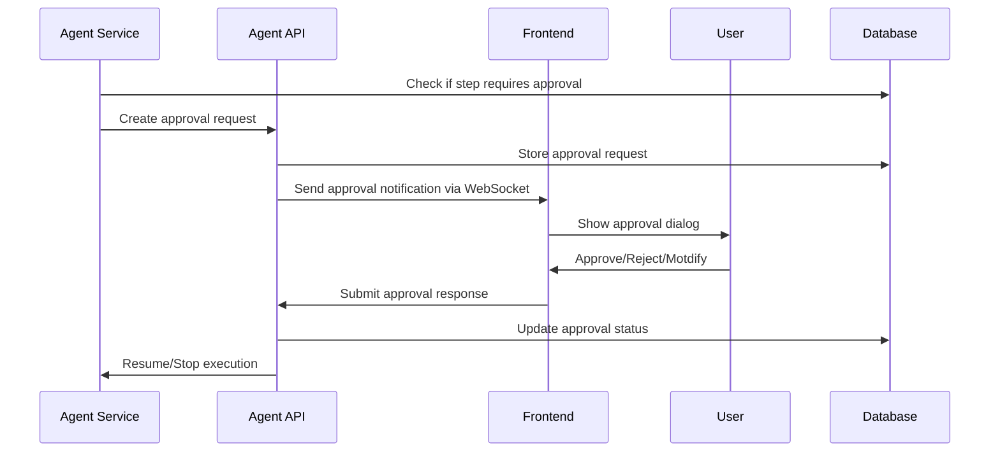
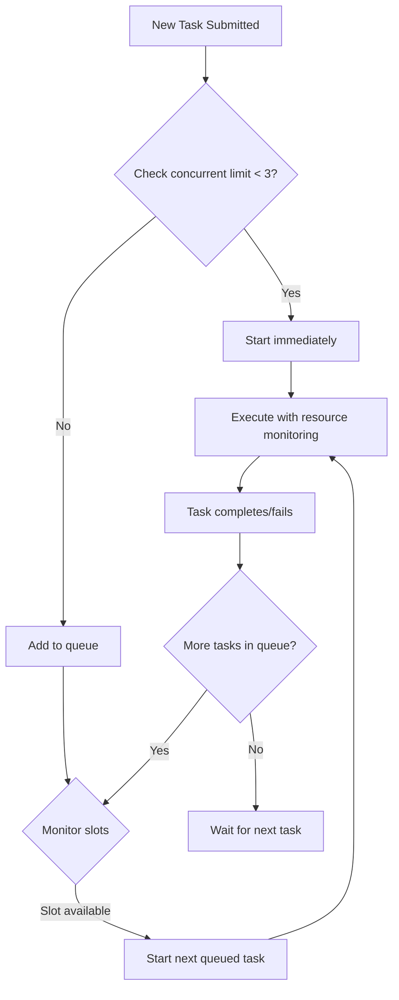

# Epic Technical Specification: Agent Mode & Task Execution

Date: 2025-11-14
Author: darius
Epic ID: epic-5
Status: Draft

---

## Overview

Epic 5 transforms Manus from a conversational advisor to an autonomous executor capable of multi-step strategic workflows. This system enables users to switch between Chat Mode (advisory responses) and Agent Mode (autonomous task execution), with comprehensive safety controls, approval gates, and detailed task tracking. The agent system leverages the existing chat infrastructure, RAG capabilities, and integrates with Google Workspace tools and web automation to execute complex strategic tasks on behalf of the user.

The implementation follows a secure-by-design approach where all sensitive actions require explicit user approval, all operations are logged for audit purposes, and the system maintains rollback capabilities for reversible actions. The agent execution engine is designed to handle concurrent tasks efficiently while preventing system overload through intelligent queueing and resource management.

## Objectives and Scope

### In Scope:
- Agent Mode toggle and UI components for mode switching
- Tool selection and routing logic with LLM-driven decision making
- Multi-step task planning and execution framework
- Approval gates for sensitive actions (file operations, code execution)
- Task history tracking with status management (pending, running, success, failed)
- Concurrent task execution limits (max 3 tasks) with queueing
- Task execution logging and debugging capabilities
- Rollback and undo functionality for reversible actions
- Integration with existing chat infrastructure and RAG system

### Out of Scope:
- Real-time workspace control (Epic 8)
- Code execution sandbox (Epic 8)
- Advanced multi-agent orchestration
- Voice-based task submission
- Custom tool creation by end-users
- Agent-to-agent communication
- Machine learning for tool selection optimization

## System Architecture Alignment

Epic 5 builds upon the foundational architecture established in Epics 1-4, extending the existing Suna + Onyx Core + LiteLLM stack with a new Agent Execution Service. The agent system integrates deeply with the chat interface, memory layer, and authentication system while maintaining clear separation of concerns.

**Key Architectural Alignments:**
- **Suna Frontend**: Extended with Agent Mode UI components, task history panels, and approval dialogs
- **LiteLLM Proxy**: Utilized for agent reasoning and tool selection decisions
- **Onyx Core**: Extended with Agent Execution Service for task orchestration
- **PostgreSQL**: Enhanced with agent_tasks and audit_logs tables
- **Redis**: Leveraged for task queueing and concurrent execution management
- **Authentication System**: Integrated for approval gate validation and audit logging

The agent system follows the same microservices pattern as the rest of ONYX, with clear API boundaries, containerized deployment, and comprehensive observability.

## Detailed Design

### Services and Modules

#### 1. Agent Execution Service (Onyx Core Extension)
**Location**: `onyx-core/services/agent_service.py`
**Responsibilities**:
- Task planning and breakdown into executable steps
- Tool selection logic using LLM reasoning
- Step-by-step execution with approval gate management
- Task state management and progress tracking
- Rollback operation coordination

**Key Components**:
- `TaskPlanner`: Breaks complex tasks into sequential steps
- `ToolSelector`: Chooses appropriate tools for each step
- `ApprovalManager`: Handles approval gates and user interactions
- `ExecutionEngine`: Executes individual steps with error handling
- `RollbackManager`: Manages undo operations for reversible actions

**Input/Output**:
- Input: Task description, user preferences, context
- Output: Task execution results, status updates, logs

#### 2. Agent Task Queue Service
**Location**: `onyx-core/services/task_queue.py`
**Responsibilities**:
- Concurrent task management (max 3 simultaneous)
- Task queuing and prioritization
- Resource allocation and monitoring
- Task lifecycle management

**Key Components**:
- `QueueManager`: Manages task queue and execution slots
- `ResourceMonitor`: Tracks system resources and task impacts
- `TaskScheduler`: Determines task execution order

#### 3. Agent API Endpoints (Suna Backend)
**Location**: `suna/app/api/agent/route.ts`
**Responsibilities**:
- HTTP API for agent task submission and monitoring
- WebSocket connections for real-time task updates
- Approval gate request handling
- Task history retrieval

**Key Endpoints**:
- `POST /api/agent`: Submit new task
- `GET /api/agent/:taskId`: Get task status and details
- `POST /api/agent/:taskId/approve`: Handle approval requests
- `POST /api/agent/:taskId/undo`: Execute rollback operation
- `GET /api/agent/history`: Retrieve task history
- `WebSocket /api/agent/:taskId/updates`: Real-time task progress

#### 4. Frontend Agent Components
**Location**: `suna/src/components/Agent/`
**Responsibilities**:
- Agent Mode toggle and UI state management
- Task submission interface
- Real-time task progress display
- Approval dialogs and interaction
- Task history viewer and log inspection

**Key Components**:
- `AgentModeToggle`: Mode switching UI component
- `TaskSubmission`: Task input and configuration interface
- `TaskProgressMonitor`: Real-time task execution display
- `ApprovalDialog`: Sensitive action approval interface
- `TaskHistory`: Task history and log viewer

### Data Models and Contracts

#### Database Schema Extensions

**agent_tasks Table**:
```sql
CREATE TABLE agent_tasks (
  id UUID PRIMARY KEY DEFAULT gen_random_uuid(),
  user_id UUID NOT NULL REFERENCES users(id),
  conversation_id UUID REFERENCES conversations(id),
  title TEXT NOT NULL,
  description TEXT NOT NULL,
  status 'pending' | 'queued' | 'running' | 'awaiting_approval' | 'success' | 'failed' | 'cancelled' DEFAULT 'pending',
  priority INTEGER DEFAULT 1,
  steps JSONB,
  current_step INTEGER DEFAULT 0,
  result TEXT,
  error_message TEXT,
  execution_time_ms INTEGER,
  created_at TIMESTAMP DEFAULT NOW(),
  started_at TIMESTAMP,
  completed_at TIMESTAMP,
  rollback_available_until TIMESTAMP,
  approval_data JSONB
);

-- Indexes for performance
CREATE INDEX idx_agent_tasks_user_status ON agent_tasks(user_id, status);
CREATE INDEX idx_agent_tasks_created_at ON agent_tasks(created_at DESC);
CREATE INDEX idx_agent_tasks_user_queue ON agent_tasks(user_id, status, priority, created_at);
```

**audit_logs Table (Extension)**:
```sql
CREATE TABLE audit_logs (
  id UUID PRIMARY KEY DEFAULT gen_random_uuid(),
  user_id UUID NOT NULL REFERENCES users(id),
  task_id UUID REFERENCES agent_tasks(id),
  action_type TEXT NOT NULL,
  action_data JSONB,
  sensitive_fields TEXT[], -- Fields to mask in logs
  ip_address INET,
  user_agent TEXT,
  created_at TIMESTAMP DEFAULT NOW()
);
```

**approval_requests Table**:
```sql
CREATE TABLE approval_requests (
  id UUID PRIMARY KEY DEFAULT gen_random_uuid(),
  task_id UUID NOT NULL REFERENCES agent_tasks(id),
  user_id UUID NOT NULL REFERENCES users(id),
  tool_name TEXT NOT NULL,
  action_description TEXT NOT NULL,
  action_preview JSONB,
  status 'pending' | 'approved' | 'rejected' | 'expired' DEFAULT 'pending',
  response TEXT,
  expires_at TIMESTAMP,
  created_at TIMESTAMP DEFAULT NOW(),
  responded_at TIMESTAMP
);
```

#### TypeScript Interfaces

```typescript
interface Task {
  id: string;
  userId: string;
  conversationId?: string;
  title: string;
  description: string;
  status: TaskStatus;
  priority: number;
  steps: TaskStep[];
  currentStep: number;
  result?: string;
  errorMessage?: string;
  executionTimeMs?: number;
  createdAt: Date;
  startedAt?: Date;
  completedAt?: Date;
  rollbackAvailableUntil?: Date;
}

interface TaskStep {
  id: string;
  stepNumber: number;
  action: string;
  toolName: string;
  parameters: Record<string, any>;
  reasoning: string;
  status: 'pending' | 'running' | 'completed' | 'failed' | 'skipped';
  result?: any;
  error?: string;
  startTime?: Date;
  completedTime?: Date;
  requiresApproval: boolean;
  approvalId?: string;
  rollbackData?: any;
}

interface Tool {
  name: string;
  description: string;
  parameters: ToolParameter[];
  sensitive: boolean;
  category: 'search' | 'file' | 'web' | 'analysis' | 'communication';
  estimatedDuration: number; // in seconds
}

interface ApprovalRequest {
  id: string;
  taskId: string;
  toolName: string;
  actionDescription: string;
  actionPreview: Record<string, any>;
  status: 'pending' | 'approved' | 'rejected' | 'expired';
  expiresAt: Date;
}
```

### APIs and Interfaces

#### Agent Task API

**POST /api/agent**
```typescript
Request: {
  task: string;
  priority?: number;
  conversationId?: string;
  context?: Record<string, any>;
}

Response: {
  success: boolean;
  data: {
    taskId: string;
    status: 'pending' | 'queued';
    estimatedDuration: number;
    queuePosition?: number;
  };
}
```

**GET /api/agent/:taskId**
```typescript
Response: {
  success: boolean;
  data: {
    task: Task;
    logs: TaskLog[];
    currentExecution?: {
      step: TaskStep;
      progress: number;
      status: string;
    };
  };
}
```

**WebSocket /api/agent/:taskId/updates**
```typescript
Real-time updates:
{
  type: 'status_change' | 'step_start' | 'step_progress' | 'step_complete' | 'error' | 'approval_request' | 'completed';
  data: {
    taskId: string;
    step?: TaskStep;
    progress?: number;
    message?: string;
    approvalRequest?: ApprovalRequest;
    result?: any;
  };
}
```

#### Approval API

**POST /api/agent/:taskId/approve**
```typescript
Request: {
  approvalId: string;
  approved: boolean;
  message?: string;
  modifiedParameters?: Record<string, any>;
}

Response: {
  success: boolean;
  data: {
    status: string;
    message: string;
  };
}
```

#### Rollback API

**POST /api/agent/:taskId/undo**
```typescript
Request: {
  stepId?: string; // Optional: if not provided, undo last step
}

Response: {
  success: boolean;
  data: {
    rollbackExecuted: boolean;
    message: string;
    remainingRollbackTime?: number; // seconds
  };
}
```

#### Task History API

**GET /api/agent/history**
```typescript
Query Parameters:
- status?: TaskStatus
- limit?: number (default: 20)
- offset?: number
- dateFrom?: string
- dateTo?: string

Response: {
  success: boolean;
  data: {
    tasks: Task[];
    total: number;
    hasMore: boolean;
  };
}
```

### Workflows and Sequencing

#### Task Execution Workflow

1. **Task Submission**
   ```
   User → Frontend → POST /api/agent → Task Queue Service → Database
   ```

2. **Task Planning**
   ```
   Task Queue Service → Agent Service → LLM (Tool Selection) → Step Generation → Database
   ```

3. **Step Execution Loop**
   ```
   For each step:
   ├─ Check if approval required → Create approval request → Wait for user response
   ├─ Execute tool → Log result → Update status
   ├─ Handle errors → Retry or fail step
   └─ Update progress → Continue to next step
   ```

4. **Task Completion**
   ```
   Agent Service → Update final status → Notify user → Cleanup resources
   ```

#### Approval Gate Flow



#### Concurrent Task Management



## Non-Functional Requirements

### Performance

**Task Execution Targets:**
- Task planning: <2 seconds for typical tasks (<5 steps)
- Tool execution: Varies by tool (see individual tool requirements)
- Approval request creation: <500ms
- WebSocket update latency: <100ms
- Concurrent task switching: <200ms overhead
- Task history loading: <1s for 100 most recent tasks

**Resource Management:**
- Max 3 concurrent tasks with configurable limits
- Memory usage per task: <100MB (excluding file operations)
- CPU usage per task: <50% of single core average
- Queue processing delay: <30 seconds under normal load

**Optimization Strategies:**
- Connection pooling for database operations
- Redis caching for task status updates
- Efficient JSON serialization for WebSocket messages
- Lazy loading of task logs and historical data
- Background job processing for long-running operations

### Security

**Approval Gates Enforcement:**
- All sensitive actions require explicit user approval
- Approval requests timeout after 5 minutes
- Sensitive actions categorized and logged separately
- Rollback capabilities time-limited (5 minutes post-completion)

**Data Protection:**
- Sensitive parameters masked in logs (API keys, passwords)
- Approval data encrypted at rest
- Task isolation between users
- Audit trail for all agent actions

**Access Control:**
- Users can only approve/reject their own tasks
- Task history isolated per user
- Admin override capabilities for troubleshooting
- IP-based restrictions for critical operations

**Input Validation:**
- Task descriptions validated for length and content
- Tool parameters validated against schemas
- File path restrictions to prevent directory traversal
- SQL injection prevention in all database operations

### Reliability/Availability

**Error Handling:**
- Graceful degradation on tool failures
- Automatic retry for transient errors (max 3 attempts)
- Comprehensive error categorization and user-friendly messages
- Fallback to manual intervention on critical failures

**Task Recovery:**
- Task state persistence across service restarts
- Resume capability for interrupted tasks
- Partial completion preservation
- Dead letter queue for failed tasks

**Monitoring:**
- Task success rate tracking (>93% target)
- Performance metrics for each tool
- Queue depth and processing time monitoring
- Resource usage alerts and thresholds

### Observability

**Logging Requirements:**
- Structured JSON logging for all agent operations
- Task execution traceability with correlation IDs
- Performance metrics captured for each step
- Error details captured with full context

**Metrics Collection:**
- Task completion rate and duration
- Tool usage frequency and success rates
- Approval request response times
- Concurrent task utilization
- Resource consumption patterns

**Alerting:**
- Task failure rate >10%
- Queue depth >10 tasks
- Average task duration >5 minutes
- Approval request timeout rate >5%

## Dependencies and Integrations

### Internal Dependencies

**Required Dependencies:**
- Epic 1: Foundation & Infrastructure (Docker, databases)
- Epic 2: Chat Interface & Core Intelligence (Suna UI, LiteLLM)
- Epic 3: RAG Integration (knowledge base for agent reasoning)
- Epic 4: Persistent Memory & Learning (context injection)

**Integration Points:**
- **Chat System**: Uses existing conversation infrastructure for task context
- **Memory Layer**: Injects user memories and standing instructions into agent reasoning
- **RAG System**: Leverages knowledge base for informed tool selection and execution
- **Authentication**: Uses existing user authentication for approval gates
- **Logging Infrastructure**: Extends existing structured logging system

### External Dependencies

**Google Workspace APIs** (Epic 6):
- Google Drive API for file operations
- Google Docs API for document creation/editing
- Google Sheets API for spreadsheet operations
- OAuth2 token management and refresh

**Web Automation APIs** (Epic 7):
- SerpAPI or Exa for web search
- Playwright for browser automation
- HTTP clients for URL scraping

**Technology Stack:**
- Node.js/TypeScript for frontend and API endpoints
- Python/FastAPI for agent execution service
- Redis for task queueing and caching
- PostgreSQL for task persistence and audit logging
- WebSocket libraries for real-time updates

## Acceptance Criteria (Authoritative)

### Core Functionality
1. **AC5.1.1**: Agent Mode toggle switches between Chat and Agent modes with visual state indication
1. **AC5.1.2**: Mode preference persists across sessions and UI reflects current mode correctly
1. **AC5.1.3**: Agent Mode shows warning about autonomous execution and approval requirements
1. **AC5.1.4**: Task submission interface differentiates from chat input with appropriate labeling
1. **AC5.1.5**: Mode switching doesn't interrupt ongoing tasks or active conversations

### Tool Selection and Planning
2. **AC5.2.1**: Agent autonomously selects appropriate tools for given task descriptions
2. **AC5.2.2**: Tool selection reasoning is logged and available for debugging
2. **AC5.2.3**: Complex tasks are broken down into sequential steps with clear dependencies
2. **AC5.2.4**: Tool selection accuracy >95% for standard task patterns
2. **AC5.2.5**: Planning phase completes within 2 seconds for typical tasks

### Approval Gates
3. **AC5.3.1**: All sensitive actions trigger approval requests before execution
3. **AC5.3.2**: Approval requests include action description, preview, and clear approve/reject options
3. **AC5.3.3**: Approval requests timeout after 5 minutes with automatic rejection
3. **AC5.3.4**: User can modify parameters before approving sensitive actions
3. **AC5.3.5**: All approval decisions are logged in audit trail with timestamps

### Task Execution
4. **AC5.4.1**: Tasks execute step-by-step with status updates for each phase
4. **AC5.4.2**: Step failures don't cancel entire task unless critical
4. **AC5.4.3**: Task progress is visible in real-time via WebSocket updates
4. **AC5.4.4**: Tasks can be paused and resumed with state preservation
4. **AC5.4.5**: Execution time estimates provided and updated during progress

### Task History and Tracking
5. **AC5.5.1**: All tasks are recorded with complete lifecycle (creation → completion)
5. **AC5.5.2**: Task history is searchable by status, date range, and keywords
5. **AC5.5.3**: Task details include steps taken, tools used, and results achieved
5. **AC5.5.4**: Failed tasks show error messages and failure points
5. **AC5.5.5**: Task history displays last 20 tasks with pagination for older records

### Logging and Debugging
6. **AC5.6.1**: Detailed execution logs captured for each task step
6. **AC5.6.2**: Logs include timestamps, input/output, and performance metrics
6. **AC5.6.3**: Sensitive data is masked in logs while preserving debugging utility
6. **AC5.6.4**: Logs can be filtered by task, step, or error type
6. **AC5.6.5**: Log data export available for compliance and analysis

### Rollback and Recovery
7. **AC5.7.1**: Undo functionality available for 5 minutes after task completion
7. **AC5.7.2**: Rollback operations reverse file creation and modifications
7. **AC5.7.3**: Rollback availability clearly indicated in task interface
7. **AC5.7.4**: Rollback actions logged with original and restored states
7. **AC5.7.5**: Critical actions (deletions, external posts) cannot be rolled back

### Concurrent Execution
8. **AC5.8.1**: Maximum 3 tasks execute simultaneously with queue for additional tasks
8. **AC5.8.2**: Queue position and estimated wait time displayed to users
8. **AC5.8.3**: Users can reorder queued tasks or cancel pending tasks
8. **AC5.8.4**: Task priority system influences execution order
8. **AC5.8.5**: System resource monitoring prevents overload from concurrent tasks

## Traceability Mapping

| Acceptance Criteria | Spec Section | Component | Test Approach |
|-------------------|--------------|-----------|---------------|
| AC5.1.1-5.1.5 (Mode Toggle) | Agent Mode Toggle | Frontend Components | Unit tests + E2E UI tests |
| AC5.2.1-5.2.5 (Tool Selection) | Tool Selection Logic | Agent Service | Integration tests with mock LLM |
| AC5.3.1-5.3.5 (Approval Gates) | Approval Gates | Approval Manager | Security tests + user workflow tests |
| AC5.4.1-5.4.5 (Task Execution) | Task Execution Workflow | Execution Engine | End-to-end task execution tests |
| AC5.5.1-5.5.5 (Task History) | Task History & Status | Task API + Database | API tests + data integrity tests |
| AC5.6.1-5.6.5 (Logging) | Task Execution Logs | Logging System | Log analysis + compliance tests |
| AC5.7.1-5.7.5 (Rollback) | Rollback & Undo | Rollback Manager | File system tests + state verification |
| AC5.8.1-5.8.5 (Concurrency) | Concurrent Execution | Task Queue Service | Load tests + resource monitoring |

## Risks, Assumptions, Open Questions

### Risks
1. **Complex Task Planning**: LLM may struggle with complex multi-step task breakdown
   - **Mitigation**: Provide structured templates and examples in planning prompts
   - **Contingency**: Implement manual task editing capabilities

2. **Tool Selection Accuracy**: Incorrect tool selection could lead to task failures
   - **Mitigation**: Extensive training data and validation rules for tool selection
   - **Monitoring**: Track tool selection accuracy and adjust prompts accordingly

3. **Resource Exhaustion**: Concurrent tasks could overwhelm system resources
   - **Mitigation**: Conservative concurrent limits and resource monitoring
   - **Scaling**: Configurable limits based on hardware capabilities

4. **Approval Gate Fatigue**: Too many approval requests could frustrate users
   - **Mitigation**: Smart categorization of sensitive vs. non-sensitive actions
   - **Optimization**: Learn from user approval patterns over time

5. **Rollback Complexity**: Implementing reliable rollback for diverse operations is challenging
   - **Mitigation**: Limit rollback to well-defined reversible operations
   - **Testing**: Extensive rollback testing for each supported tool

### Assumptions
1. **LLM Reliability**: DeepSeek (or fallback LLM) maintains consistent reasoning quality
2. **User Availability**: Users are available to respond to approval requests within 5 minutes
3. **Tool API Stability**: External tool APIs (Google, web services) remain stable and available
4. **Network Connectivity**: Consistent network connectivity for real-time updates
5. **Database Performance**: PostgreSQL can handle task volume with sub-50ms response times

### Open Questions
1. **Tool Expansion**: Should users be able to define custom tools beyond the core set?
2. **Learning Integration**: How can agent learn from successful task patterns for better future performance?
3. **Multi-User Support**: How would concurrent multi-user agent execution work in team environments?
4. **Advanced Workflows**: Should we support conditional branching and loop constructs in task planning?
5. **Integration Depth**: How deeply should agents integrate with external systems beyond the defined tool set?

## Test Strategy Summary

### Unit Testing
- **Agent Service**: Task planning, tool selection, and execution logic
- **Approval Manager**: Approval request creation, timeout handling, and response processing
- **Task Queue**: Concurrent task management and resource allocation
- **Frontend Components**: Mode toggle, task submission, progress display, approval dialogs
- **API Endpoints**: Request validation, response formatting, error handling

### Integration Testing
- **End-to-End Task Execution**: Complete task workflows from submission to completion
- **Tool Integration**: Test each tool's integration with the agent framework
- **Database Operations**: Task persistence, status updates, and audit logging
- **WebSocket Communication**: Real-time updates and approval notifications
- **LLM Integration**: Tool selection and planning with actual LLM responses

### Security Testing
- **Approval Gate Bypass**: Attempt to execute sensitive actions without approval
- **Input Validation**: Malicious task descriptions and parameters
- **Data Isolation**: Ensure users cannot access other users' tasks or approvals
- **Audit Trail Verification**: Comprehensive logging of all sensitive operations
- **Rollback Security**: Ensure rollback cannot be used for unauthorized data access

### Performance Testing
- **Concurrent Task Load**: Test system behavior with maximum concurrent tasks
- **Queue Performance**: Measure task queuing and processing under high load
- **Resource Utilization**: Monitor CPU, memory, and database connection usage
- **WebSocket Scalability**: Test real-time updates with multiple concurrent users
- **Database Performance**: Verify query performance under task volume

### User Acceptance Testing
- **Mode Switching**: Seamless transition between Chat and Agent modes
- **Approval Workflows**: User experience with approval requests and responses
- **Task History Navigation**: Usability of task history and log inspection
- **Error Handling**: User experience with task failures and recovery options
- **Rollback Functionality**: User understanding and effective use of undo features

---

*This technical specification provides the foundation for implementing Epic 5's Agent Mode & Task Execution functionality. The design balances powerful autonomous capabilities with essential safety controls and user oversight, ensuring the system enhances user productivity while maintaining security and reliability.*

*Implementation should proceed incrementally, starting with core task execution and approval gates, followed by advanced features like rollback and concurrent task management.*