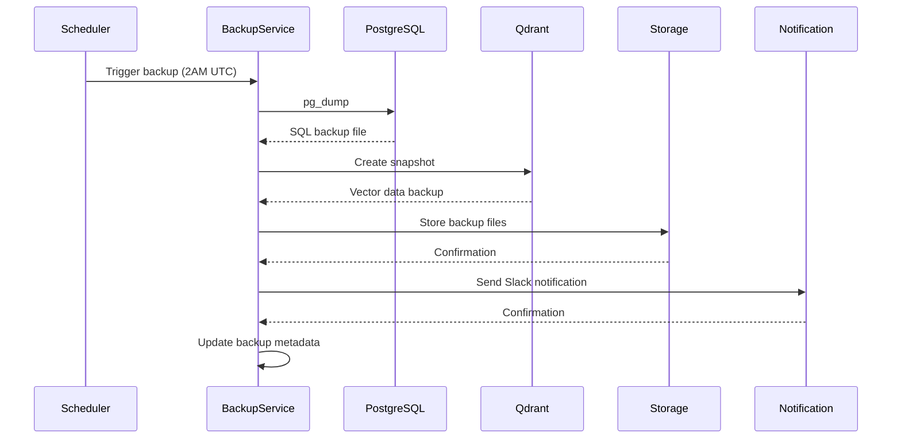
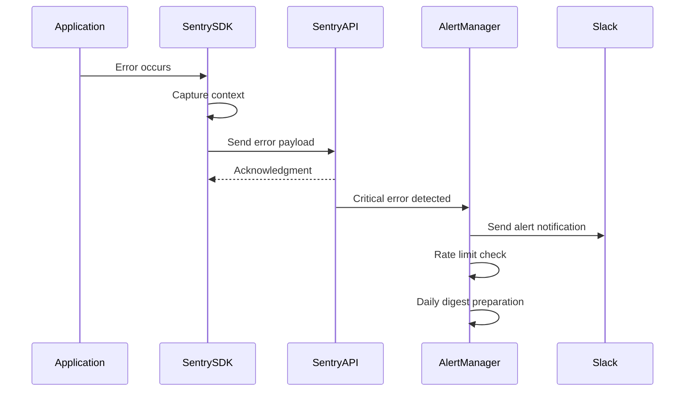
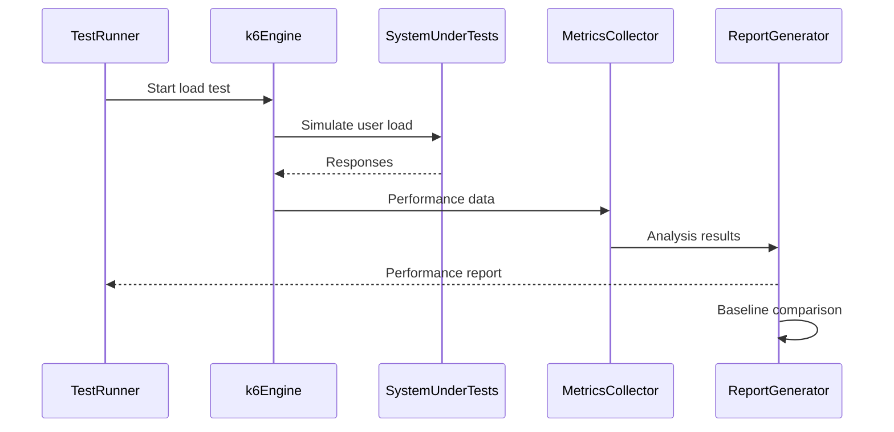

# Epic Technical Specification: Monitoring & DevOps

Date: 2025-11-15
Author: darius
Epic ID: epic-9
Status: Draft

---

## Overview

The ONYX Monitoring & DevOps epic establishes comprehensive observability, reliability, and operational excellence for the Manus Internal strategic intelligence system. Building upon the existing Prometheus/Grafana foundation in Docker Compose, this epic implements production-ready monitoring, error tracking, backup automation, incident response procedures, and launch readiness. The scope covers system health monitoring, performance metrics, alerting, automated backup/restore, load testing, and comprehensive launch preparation to ensure 99.5% uptime target and confident December 15, 2025 launch.

## Objectives and Scope

### In Scope:
- **Metrics Infrastructure**: Prometheus scraping from all services (15s intervals) with Grafana dashboards for system health, latency, resource usage
- **Error Tracking**: Sentry integration with Slack/email notifications, error context capture, and daily digests
- **Backup & Recovery**: Automated daily backups of PostgreSQL, Qdrant, and Docker volumes with <1hr restoration time
- **Incident Response**: Documented playbooks for common failure scenarios with decision trees and escalation procedures
- **Performance Validation**: Load testing for 20 concurrent users with baseline establishment and bottleneck identification
- **Launch Readiness**: Comprehensive go-live checklist covering code, infrastructure, monitoring, security, documentation, and user onboarding

### Out of Scope:
- Advanced security monitoring (SIEM, threat detection)
- Multi-region disaster recovery (single VPS deployment)
- Advanced analytics and business intelligence
- User behavior analytics and A/B testing
- Automated scaling (manual scaling only)

## System Architecture Alignment

This epic enhances the existing Docker Compose multi-service architecture by adding observability layers without disrupting core functionality:

**Integration Points:**
- **Prometheus**: Leverages existing `/metrics` endpoints from Suna (Next.js), Onyx Core (Python), LiteLLM proxy, and infrastructure services
- **Grafana**: Uses existing Docker network (`manus-network`) for service discovery and secure internal communication
- **Sentry**: Integrates with Node.js and Python runtimes via SDKs, respecting existing error handling patterns
- **Backup Automation**: Interfaces with Supabase PostgreSQL and Qdrant backup APIs, respecting existing data schemas
- **Load Testing**: Validates existing performance targets (<1.5s chat latency, <200ms RAG retrieval)

**Constraints:**
- Must work within KVM 4 resource limits (4 vCPU, 16GB RAM)
- Cannot impact existing service latency or functionality
- Must maintain single-VPS deployment simplicity
- Self-hosted only, no external SaaS dependencies

## Detailed Design

### Services and Modules

#### 9.1 Prometheus Metrics Enhancement
| Component | Responsibilities | Inputs | Outputs | Owner |
|-----------|----------------|---------|---------|--------|
| Prometheus Config | Service discovery, scrape intervals | Docker service endpoints | Metrics storage | Ops |
| Custom Exporters | Business metrics (LLM calls, RAG queries) | Application logs | Prometheus format | Backend |
| Metrics Middleware | Request latency, error rates | HTTP requests | Counter/Gauge | Backend |

#### 9.2 Sentry Error Tracking
| Component | Responsibilities | Inputs | Outputs | Owner |
|-----------|----------------|---------|---------|--------|
| Sentry SDK | Error capture, context collection | Application errors | Sentry API | Full Stack |
| Alert Manager | Slack/email notifications | Sentry webhooks | Notifications | Ops |
| Error Dashboard | Error aggregation, assignment | Sentry API | UI | Full Stack |

#### 9.3 Backup Automation Service
| Component | Responsibilities | Inputs | Outputs | Owner |
|-----------|----------------|---------|---------|--------|
| Backup Scheduler | Cron job execution (2AM UTC) | System time | Backup jobs | Ops |
| PostgreSQL Backup | pg_dump execution | DB credentials | SQL files | Ops |
| Qdrant Backup | API snapshot creation | Qdrant endpoint | Vector data | Ops |
| Storage Manager | S3/local storage, retention | Backup files | Stored backups | Ops |

#### 9.4 Load Testing Framework
| Component | Responsibilities | Inputs | Outputs | Owner |
|-----------|----------------|---------|---------|--------|
| k6 Test Scripts | User simulation, scenarios | Test parameters | Load requests | QA |
| Metrics Collector | Performance data capture | System responses | Test results | QA |
| Report Generator | Baseline documentation | Test data | Performance report | QA |

### Data Models and Contracts

#### Metrics Schema
```yaml
# Prometheus metrics format
onyx_chat_duration_seconds:
  type: histogram
  labels: [model, user_id, success]
  buckets: [0.1, 0.5, 1.0, 1.5, 2.0, 5.0]

onyx_rag_retrieval_duration_seconds:
  type: histogram
  labels: [vector_count, similarity_threshold]
  buckets: [0.05, 0.1, 0.2, 0.5, 1.0]

onyx_task_completion_total:
  type: counter
  labels: [task_type, success, duration_category]

onyx_active_agents:
  type: gauge
  labels: [agent_type, status]
```

#### Backup Metadata
```yaml
backup_metadata:
  backup_id: string (uuid)
  timestamp: datetime (UTC)
  backup_type: enum [daily, weekly, monthly]
  components:
    postgresql:
      size_gb: float
      checksum: string
      tables_count: integer
    qdrant:
      size_gb: float
      vector_count: integer
      collections_count: integer
    docker_volumes:
      volume_name: string
      size_gb: float
      file_count: integer
  status: enum [in_progress, completed, failed]
  retention_days: integer
```

#### Error Context Schema
```typescript
interface SentryErrorContext {
  user_id?: string;
  session_id: string;
  request_context: {
    url: string;
    method: string;
    headers: Record<string, string>;
    body_size: number;
  };
  system_context: {
    service_name: string;
    version: string;
    container_id: string;
    memory_usage_mb: number;
    cpu_usage_percent: number;
  };
  breadcrumbs: Array<{
    timestamp: string;
    message: string;
    category: string;
    level: string;
  }>;
}
```

### APIs and Interfaces

#### Backup Service API
```yaml
POST /api/backup/trigger:
  description: Manual backup trigger
  request:
    backup_type: string [daily, weekly, monthly]
    components: string[] [postgresql, qdrant, volumes]
  response:
    backup_id: string
    status: string [started, already_running]

GET /api/backup/status/{backup_id}:
  description: Check backup status
  response:
    backup_id: string
    status: string [in_progress, completed, failed]
    progress: number (0-100)
    components_completed: string[]

POST /api/backup/restore/{backup_id}:
  description: Restore from backup
  request:
    confirm: boolean
    components: string[] [postgresql, qdrant, volumes]
  response:
    restore_id: string
    estimated_time_minutes: integer
```

#### Metrics Health API
```yaml
GET /api/metrics/health:
  description: Metrics collection health check
  response:
    prometheus_scraping: boolean
    last_scrape: datetime
    services_reporting: string[]
    metrics_count: integer

GET /api/metrics/summary:
  description: Key metrics summary
  response:
    uptime_percentage: float
    avg_response_time_ms: float
    error_rate_percent: float
    active_users: integer
    tasks_completed_today: integer
```

#### Load Testing API
```yaml
POST /api/load-test/start:
  description: Initiate load test
  request:
    concurrent_users: integer
    duration_seconds: integer
    scenario: string [chat, rag, agent_tasks]
  response:
    test_id: string
    estimated_duration_minutes: integer

GET /api/load-test/results/{test_id}:
  description: Get load test results
  response:
    test_id: string
    status: string [running, completed, failed]
    metrics:
      avg_latency_ms: float
      p95_latency_ms: float
      requests_per_second: float
      error_rate: float
      peak_memory_gb: float
```

### Workflows and Sequencing

#### Backup Workflow


#### Error Tracking Workflow


#### Load Testing Workflow


## Non-Functional Requirements

### Performance

**Metrics Collection Overhead:**
- Prometheus scraping adds <5% CPU overhead to monitored services
- Metrics endpoint response time <10ms (p95)
- Grafana dashboard loading time <2 seconds
- Load test execution completes within 30 minutes

**Backup Performance:**
- PostgreSQL backup creation <10 minutes for 1GB database
- Qdrant snapshot creation <5 minutes for 100k vectors
- Full backup completion <30 minutes
- Restore time <60 minutes from backup files

**Alert Latency:**
- Critical error alerts sent within 30 seconds of error occurrence
- Backup failure notifications sent within 5 minutes
- Load test threshold breaches alerted in real-time

### Security

**Credential Management:**
- Sentry DSN stored in environment variables (encrypted in .env)
- Backup storage credentials encrypted using Docker secrets
- API endpoints protected with IP whitelist (internal only)
- Metrics endpoints require basic authentication (admin/admin)

**Data Privacy:**
- Error context excludes sensitive user data (passwords, tokens)
- Backup files encrypted at rest (AES-256)
- No PII stored in metrics or logs
- Grafana access restricted to internal IP ranges

### Reliability/Availability

**Backup Reliability:**
- Backup success rate >99% (automated retry on failure)
- Backup verification through checksum validation
- Redundant storage (local + cloud if S3 configured)
- Automatic cleanup of old backups per retention policy

**Monitoring Reliability:**
- Prometheus uptime >99.9% (auto-restart on failure)
- Grafana dashboard availability >99%
- Sentry API failover with local error logging
- Load test framework idempotent and restartable

### Observability

**Logging Requirements:**
- Structured JSON logs for all backup operations
- Load test execution logs with detailed metrics
- Error tracking breadcrumbs with request/response context
- Audit trail for all manual backup/restore operations

**Metrics Coverage:**
- System metrics: CPU, memory, disk, network (all containers)
- Application metrics: request latency, error rates, throughput
- Business metrics: LLM calls, RAG queries, task completions
- Infrastructure metrics: Docker container health, service dependencies

**Alert Coverage:**
- Service down/unresponsive alerts
- Performance degradation alerts (>2x baseline latency)
- Resource exhaustion alerts (>90% CPU/memory usage)
- Backup failure alerts with retry attempts

## Dependencies and Integrations

### Internal Dependencies
- **Docker Compose Infrastructure**: All monitoring services depend on existing Docker network and service definitions
- **PostgreSQL (Supabase)**: Database backup functionality requires pg_dump access and sufficient permissions
- **Qdrant Vector Database**: Backup API integration requires access to snapshot endpoints
- **LiteLLM Proxy**: Metrics collection requires /metrics endpoint exposure
- **Nginx Reverse Proxy**: Routes monitoring UI traffic (Grafana:3001, Prometheus:9090)

### External Dependencies
- **Sentry (self-hosted or cloud)**: Error tracking backend with API access
- **k6 Load Testing Tool**: Open-source load testing framework
- **Amazon S3 (optional)**: Backup storage destination (or local VPS storage)
- **Slack Webhook**: Critical alert notifications channel

### Integration Constraints
- **Resource Limits**: Monitoring services must fit within existing KVM 4 resource allocation
- **Network Security**: All monitoring endpoints must be internal-only and protected
- **Data Impact**: Metrics collection cannot impact application performance or user experience
- **Maintenance Overhead**: Monitoring setup must be low-maintenance and automated where possible

## Acceptance Criteria (Authoritative)

1. **AC9.1.1**: Prometheus successfully scrapes metrics from all 6 core services (Suna, Onyx, Qdrant, Supabase, Redis, LiteLLM) at 15-second intervals
2. **AC9.1.2**: Grafana displays 5 operational dashboards (System Overview, Application Performance, LLM Metrics, RAG Performance, Infrastructure Health) updating every 10 seconds
3. **AC9.1.3**: Metrics endpoint response time <10ms (p95) across all services
4. **AC9.1.4**: Grafana dashboards accessible at http://localhost:3001 with authentication
5. **AC9.2.1**: Sentry captures errors from both Node.js (Suna) and Python (Onyx) services with full stack traces
6. **AC9.2.2**: Error context includes user_id, session_id, request details, and system breadcrumbs
7. **AC9.2.3**: Critical errors trigger immediate Slack notifications; daily email digests sent at 9 AM UTC
8. **AC9.2.4**: Error rate calculation excludes 404s and rate limit errors (configurable ignore list)
9. **AC9.3.1**: Automated daily backup job executes at 2 AM UTC with 99%+ success rate
10. **AC9.3.2**: Backup includes PostgreSQL dump, Qdrant snapshot, and Docker volume archives
11. **AC9.3.3**: Backup retention policy enforced: 7 daily + 4 weekly + 12 monthly backups
12. **AC9.3.4**: Backup completion/failure notifications sent via Slack with detailed status
13. **AC9.4.1**: Backup restoration procedure documented and tested monthly (dry run)
14. **AC9.4.2**: Full system restoration from backup completes in <60 minutes
15. **AC9.4.3**: Restoration procedure includes data integrity verification steps
16. **AC9.5.1**: Incident response playbooks documented for 6 common scenarios (LLM service down, database failure, high resource usage, vector DB corruption, SSL expiry, sync job failure)
17. **AC9.5.2**: Each playbook includes symptoms, diagnosis steps, resolution procedures, and prevention measures
18. **AC9.5.3**: Playbooks stored in INCIDENTS.md with decision tree navigation
19. **AC9.6.1**: Load test successfully simulates 20 concurrent users with 100 total messages
20. **AC9.6.2**: Performance baseline established: chat latency <1.5s (p95), RAG retrieval <200ms, memory usage <12GB peak
21. **AC9.6.3**: Load test results documented with bottleneck identification and remediation plan
22. **AC9.7.1**: Launch checklist completed with all 10 sections verified (code, deployment, infrastructure, data, monitoring, security, documentation, testing, onboarding, communications)
23. **AC9.7.2**: Go-live procedures documented with owner assignments and sign-off requirements
24. **AC9.7.3**: Launch readiness confirmed by engineering, operations, and product management leads

## Traceability Mapping

| AC | PRD Requirement | Spec Section | Component/API | Test Idea |
|----|-----------------|--------------|---------------|-----------|
| AC9.1.1-9.1.4 | 99.5% uptime target (Success Criteria) | Services and Modules | Prometheus Exporters | Verify all 6 services report metrics |
| AC9.2.1-9.2.4 | Real-time error discovery | Error Tracking | Sentry SDK Integration | Inject test error and verify alert |
| AC9.3.1-9.3.4 | <1hr restore time | Backup Automation | Backup Service API | Trigger backup and verify completion |
| AC9.4.1-9.4.3 | Data recovery capability | Backup Procedures | Restore API | Test restore from recent backup |
| AC9.5.1-9.5.3 | Incident response capability | Incident Response | INCIDENTS.md | Simulate incident and follow playbook |
| AC9.6.1-9.6.3 | Performance validation | Load Testing | k6 Framework | Execute load test scenario |
| AC9.7.1-9.7.3 | Confident launch preparation | Launch Procedures | LAUNCH.md | Complete checklist review |

## Risks, Assumptions, Open Questions

### Risks
1. **Resource Overhead**: Monitoring services may impact system performance within KVM 4 constraints
   - **Mitigation**: Monitor overhead metrics, implement sampling for high-frequency metrics
2. **Backup Storage Limits**: VPS storage may be insufficient for backup retention policy
   - **Mitigation**: Implement compression, consider external S3 storage, monitor storage usage
3. **Alert Fatigue**: Too many false positives could lead to ignored alerts
   - **Mitigation**: Tune alert thresholds, implement alert grouping, review alert effectiveness weekly
4. **Complexity Increase**: Additional services may increase deployment and maintenance complexity
   - **Mitigation**: Automate setup/teardown, comprehensive documentation, health checks

### Assumptions
1. **Existing Infrastructure**: Current Docker Compose setup has sufficient capacity for additional monitoring services
2. **Network Access**: All services can communicate within Docker network for metrics collection
3. **Backup APIs**: Qdrant and Supabase provide reliable backup/snapshot APIs
4. **Team Skills**: Team has basic DevOps knowledge for Prometheus/Grafana configuration

### Open Questions
1. **Backup Storage Strategy**: Should backups use local VPS storage or external cloud storage (S3)?
2. **Sentry Deployment**: Use cloud Sentry or self-hosted instance for error tracking?
3. **Load Testing Frequency**: How often should load tests be run (monthly, quarterly)?
4. **Alert Escalation**: Who should receive critical alerts and what's the escalation procedure?

## Test Strategy Summary

**Test Levels:**
- **Unit Tests**: Custom metrics exporters, backup scripts, alert configurations
- **Integration Tests**: Sentry integration, backup/restore workflows, Prometheus scraping
- **End-to-End Tests**: Complete backup/restore cycle, incident response playbook execution
- **Performance Tests**: Load testing with k6, metrics collection overhead measurement

**Test Coverage:**
- All acceptance criteria covered by automated or manual test procedures
- Monitoring infrastructure resilience tested with failure scenarios
- Backup/restore procedures validated monthly with dry runs
- Load testing establishes performance baseline and identifies bottlenecks

**Test Frameworks:**
- **Backend**: Jest for Node.js services, pytest for Python services
- **Infrastructure**: Docker Compose health checks, custom test scripts
- **Load Testing**: k6 with realistic user scenarios
- **Monitoring**: Prometheus query validation, Grafana dashboard verification

**Quality Gates:**
- All services report metrics to Prometheus consistently
- Backup success rate >99% with verification procedures
- Load test meets performance targets (<1.5s chat latency, <200ms RAG)
- Incident response playbooks tested and team trained
- Launch checklist completed with all sign-offs obtained